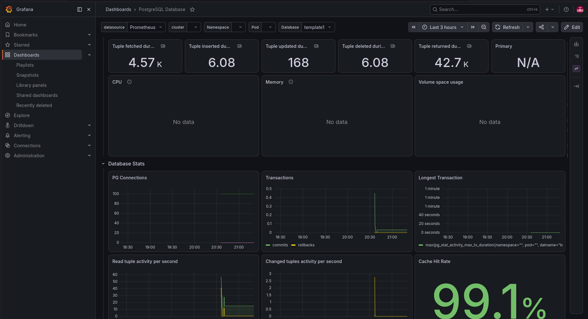

# DevOps Take-Home: PostgreSQL Observability Dashboard

## The Task
Stand up a PostgreSQL instance, load the LEGO dataset into it, generate realistic query load against it,
and build a dashboard that shows what the database is doing under that load.

## Usage
- `docker compose up -d` to start in the background.
- open Grafana dashboard at `localhost:3000`.
- `docker compose down` to stop it.

## Technology Choices
- I used PostgreSQL version 18 because it is the latest version tested by [postgres_exporter](https://github.com/prometheus-community/postgres_exporter#postgresql-server-exporter).
- I used Prometheus since its the standared for collecting data and it has a postgres exporter.
- I used Grafana since its the standared time-series dashboard that work well with Promethus and has a [pre-built dashboard for postgres](https://github.com/wiremind/wiremind-grafana-dashboards/blob/master/postgresql-database.json)
- I used docker-compose for a "single entrypoint" as needed.
- I used python for load generating because it is easy to read and write, saving me time.
